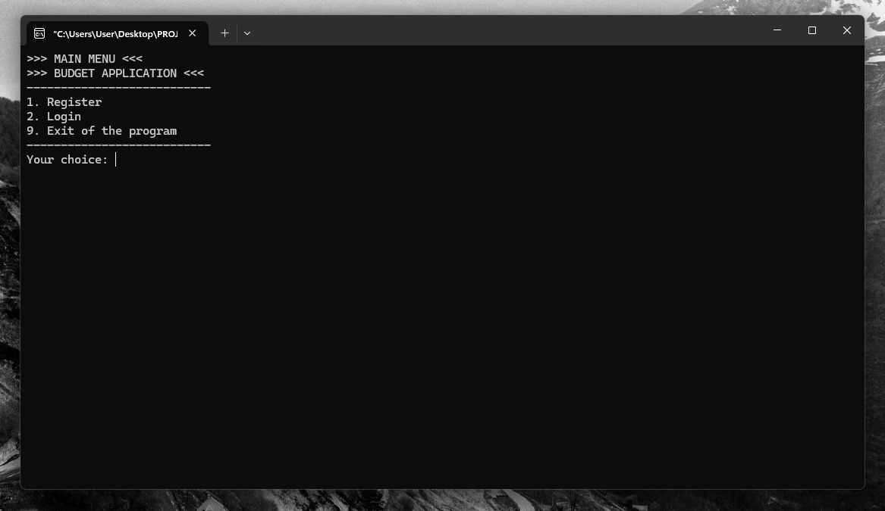
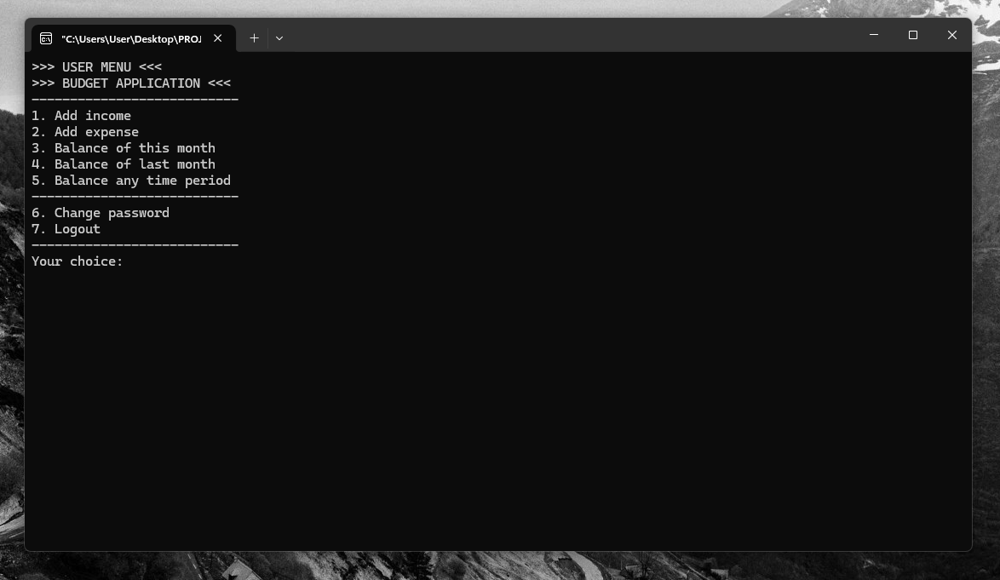
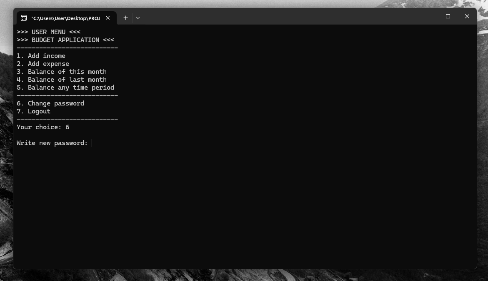

# Budget App

This application will help you manage your budget.

# Project Name
- This application will help you manage your budget. You can add expenses, revenues and check the balance for any period on an  ongoing basis. Registration and subsequent logging in at any time will allow you to conveniently access your data. I keep my fingers crossed that the balance will always be positive :)

## Table of Contents
* [General Info](#general-information)
* [Technologies Used](#technologies-used)
* [Features](#features)
* [Screenshots](#screenshots)
* [Acknowledgements](#acknowledgements)
* [Contact](#contact)

## General Information

Registration Panel
Login Panel
When you logged in:

Add income
Add expense
Calculate finances from current month
Calculate finances from previous month
Calculate finances from time interval
Change user password
Logout the user

## Technologies Used
- C++
- C++ Objective

## Features
List the ready features here:

## Screenshots

## Acknowledgements

## Contact
Created by [@mr_cyclist] - contact me!
